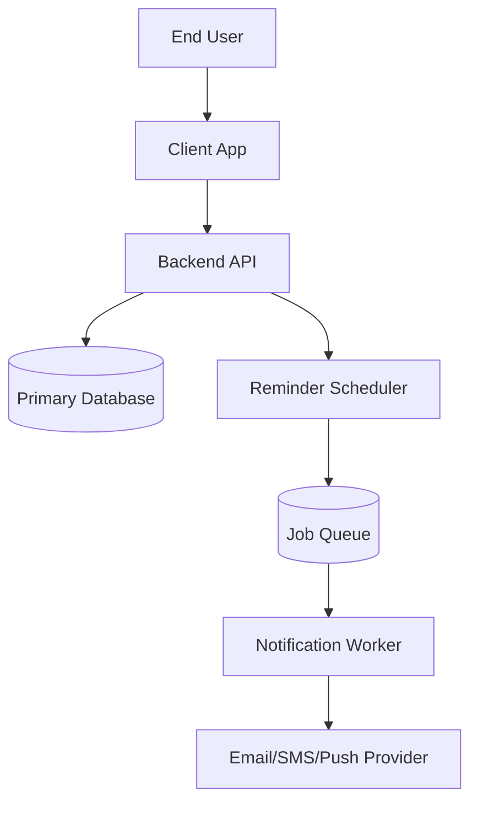

# System Overview

## Component Responsibilities
- Client App: event CRUD, reminder setup, delivery status display
- Backend API: auth, validation, orchestration, persistence
- Reminder Scheduler: computes and enqueues delivery jobs
- Notification Worker: executes delivery and retry policy
- Database: stores users, events, reminders, delivery attempts

## Reliability Objectives
- Idempotent scheduling and sending
- Observable delivery pipeline with retry paths
- Timezone and DST-safe event calculations
